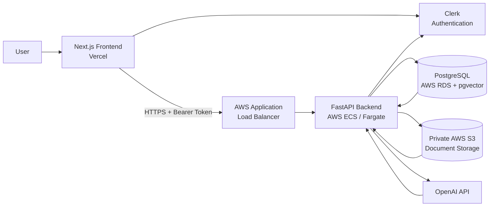

# Contextly

### Your knowledge, grounded.

Contextly is a production-style Retrieval-Augmented Generation (RAG) application for asking questions over private documents and receiving answers backed by verifiable source citations.

Users can securely upload PDF documents, build a private knowledge base, and ask natural-language questions. Contextly combines semantic vector search with PostgreSQL full-text search to retrieve relevant evidence before generating citation-backed answers.

**Live application:** https://contextly.osazeeero.com

---

## Product Preview

### Landing Page


### Knowledge Dashboard


### Document Management


### Grounded Q&A with Citations


---

## Why I Built Contextly

Large language models can generate convincing answers even when the underlying information is incorrect or unavailable.

Contextly was built around a different principle:

> **Retrieve evidence first. Generate from evidence second.**

The system creates a private knowledge base from a user's documents and retrieves relevant passages for each question. The language model is instructed to answer from this retrieved context and return citations that can be traced back to the source document and page.

The project was also an exercise in taking RAG beyond a prototype: authentication, tenant isolation, retrieval evaluation, usage controls, persistent conversations, private object storage, observability, containerization, and cloud deployment are all part of the system.

---

## Key Features

- **Private document knowledge bases** — authenticated users maintain isolated document collections.
- **PDF ingestion pipeline** — validates, stores, extracts, chunks, embeds, and indexes uploaded documents.
- **Hybrid retrieval** — combines vector similarity search with PostgreSQL full-text search.
- **Reciprocal Rank Fusion (RRF)** — merges semantic and lexical retrieval rankings.
- **Citation-backed answers** — responses include references to retrieved source documents and pages.
- **Persistent conversations** — conversations and messages are stored and scoped to each user.
- **Usage controls** — document, storage, and daily question limits are enforced server-side.
- **Authentication & tenant isolation** — Clerk authentication with backend ownership enforcement.
- **Production observability** — request IDs, structured logging, latency measurements, and usage metrics.
- **Cloud deployment** — containerized FastAPI backend deployed on AWS ECS with PostgreSQL/pgvector on RDS and private document storage in S3.

---

## Architecture



### Production request path

```text
Browser
   ↓
Next.js / Vercel
   ↓
Clerk Authentication
   ↓ HTTPS
api.osazeeero.com
   ↓
AWS Application Load Balancer
   ↓
FastAPI on ECS Fargate
   ├── PostgreSQL + pgvector / RDS
   ├── Private S3 document storage
   └── OpenAI API
```

TLS termination is handled through AWS Application Load Balancer + AWS Certificate Manager for the API domain.

---

## RAG Pipeline

Contextly uses a hybrid retrieval pipeline rather than relying solely on embedding similarity.

```text
PDF Upload
    ↓
File Validation
    ↓
Private Object Storage
    ↓
PDF Text + Page Extraction
    ↓
Chunking
    ↓
OpenAI Embeddings
    ↓
PostgreSQL + pgvector
    ↓
┌───────────────────────┐
│                       │
Semantic Retrieval   Full-Text Retrieval
   top 20                top 20
│                       │
└───────────┬───────────┘
            ↓
Reciprocal Rank Fusion
        RRF (K=60)
            ↓
       Top 5 Chunks
            ↓
Prompt Construction
            ↓
LLM Answer Generation
            ↓
Citation Validation
            ↓
Grounded Response
```

### Chunking

Documents are currently chunked using:

```text
Chunk size:    1,200 characters
Chunk overlap:   200 characters
```

Each chunk retains metadata including its document and source page.

### Semantic retrieval

Document chunks are embedded with:

```text
text-embedding-3-small
```

Embeddings are stored using `pgvector` and retrieved using cosine distance.

### Lexical retrieval

A second, independent retrieval path uses PostgreSQL full-text search.

This helps recover passages containing important exact terminology that semantic retrieval alone may rank poorly.

### Reciprocal Rank Fusion

The two ranked result sets are combined using Reciprocal Rank Fusion:

```text
RRF score = Σ 1 / (K + rank)

K = 60
```

The final top five chunks are supplied as evidence to the answer-generation stage.

This architecture was selected after evaluating multiple retrieval strategies rather than assuming a more complex pipeline would automatically perform better.

---

## Retrieval Evaluation

I built a dedicated evaluation dataset and scripts to measure retrieval performance independently from answer generation.

### Final retrieval results

| Metric | Result |
|---|---:|
| Recall@1 | **63.33%** |
| Recall@3 | **86.67%** |
| Recall@5 | **86.67%** |
| Mean Reciprocal Rank (MRR) | **0.7444** |

The evaluation set contains questions mapped to expected source documents/pages.

Several retrieval configurations were tested, including:

- vector-only retrieval,
- semantic retrieval with keyword reranking,
- larger semantic candidate pools,
- independent PostgreSQL full-text search,
- hybrid retrieval with Reciprocal Rank Fusion,
- alternative chunk sizes.

The final production pipeline uses independent semantic + lexical retrieval followed by RRF.

The evaluation process also highlighted an important engineering lesson: increasing retrieval complexity does not necessarily improve measured retrieval quality. After the hybrid pipeline reached the same Recall@5 ceiling as further experiments, I stopped tuning rather than overfitting the evaluation set.

---

## Answer & Citation Evaluation

Answer generation was evaluated separately from retrieval.

| Metric | Result |
|---|---:|
| Answer generated successfully | **96.67%** |
| Expected-page citation match | **86.67%** |

The citation metric measures whether the expected source document/page appears among the returned citations. It should **not** be interpreted as a complete factual-groundedness score.

Keeping retrieval and generation evaluation separate makes it easier to determine whether a failure originates from evidence retrieval or answer generation.

---

## Authentication & Tenant Isolation

Contextly uses **Clerk** for identity and session management.

The backend does not trust user identifiers supplied by the browser. Instead:

```text
Browser
   ↓
Clerk session token
   ↓
FastAPI verifies token
   ↓
Verified Clerk user ID
   ↓
Internal Contextly user
   ↓
Ownership-scoped database queries
```

Documents, conversations, messages, chunks, and usage records are scoped to the authenticated user.

Tenant isolation was tested using multiple Clerk accounts to verify that one user cannot retrieve another user's documents or conversations.

---

## Usage & Resource Controls

The application enforces resource limits on the backend rather than relying on frontend UI restrictions.

Current free-plan limits include:

```text
Documents:          10
Questions per day:  20
Storage:            100 MB
Maximum PDF size:   10 MB
```

Daily question consumption is handled atomically to reduce quota race conditions.

The frontend displays usage information, but the database/backend remains the source of truth.

---

## Document Processing

Each uploaded PDF follows an independent lifecycle:

```text
Upload
  ↓
Validation
  ↓
Storage
  ↓
Processing
  ↓
Text extraction
  ↓
Chunking
  ↓
Embedding
  ↓
Indexing
  ↓
Ready
```

The upload layer validates:

- file extension,
- MIME type,
- PDF signature,
- file size,
- empty files,
- encrypted PDFs,
- parseability,
- page count.

Documents are stored using generated storage keys rather than trusting user-provided filenames.

The frontend polls processing documents until they transition to `Ready` or `Failed`.

---

## Security Design

Several production-oriented security decisions are built into Contextly:

- Clerk-issued session tokens are verified by the backend.
- Resource ownership is enforced server-side.
- S3 buckets are private with public access blocked.
- ECS accesses S3 through an IAM task role rather than embedded AWS credentials.
- Application secrets are stored in AWS Secrets Manager.
- RDS is not publicly accessible.
- PostgreSQL accepts database traffic from the ECS security group rather than the public internet.
- The public API is exposed through HTTPS using an Application Load Balancer and ACM certificate.
- Sensitive document contents, prompts, answers, embeddings, and API keys are excluded from application logs.

---

## Observability

The FastAPI service includes structured request logging with request IDs and latency measurements.

RAG requests record operational information such as:

```text
request_id
request duration
retrieval timing
generation timing
request outcome
quota outcome
```

Sensitive document and conversation contents are intentionally excluded from logs.

This provides enough information to diagnose production failures without unnecessarily logging private user data.

---

## Technology Stack

| Layer | Technology |
|---|---|
| Frontend | Next.js, TypeScript, Tailwind CSS |
| Authentication | Clerk |
| Backend | FastAPI, Python |
| Database | PostgreSQL |
| Vector Search | pgvector |
| Lexical Search | PostgreSQL Full-Text Search |
| Embeddings | OpenAI `text-embedding-3-small` |
| LLM | OpenAI API |
| Object Storage | Amazon S3 |
| Backend Compute | AWS ECS / Fargate |
| Database Hosting | Amazon RDS |
| Load Balancing | AWS Application Load Balancer |
| TLS | AWS Certificate Manager |
| Secrets | AWS Secrets Manager |
| Frontend Hosting | Vercel |
| Containers | Docker |
| Database Migrations | Alembic |

---

## Repository Structure

```text
contextly/
├── backend/
│   ├── alembic/
│   ├── app/
│   │   ├── api/
│   │   ├── core/
│   │   ├── models/
│   │   ├── schemas/
│   │   └── services/
│   ├── evaluation/
│   ├── Dockerfile
│   └── requirements.txt
│
├── frontend/
│   ├── src/
│   │   ├── app/
│   │   ├── components/
│   │   ├── hooks/
│   │   └── lib/
│   ├── Dockerfile
│   └── package.json
│
├── docs/
│   └── images/
│
├── .env.example
├── docker-compose.yml
└── README.md
```

---

## Running Locally

### Prerequisites

You will need:

- Docker / Docker Compose
- Node.js
- Python
- PostgreSQL with pgvector
- Clerk application credentials
- OpenAI API credentials

Clone the repository:

```bash
git clone https://github.com/osazee-ero/contextly.git
cd contextly
```

Create your environment configuration from the provided example:

```bash
cp .env.example .env
```

Add the required development credentials to your local `.env`.

> Never commit real API keys, database passwords, Clerk secrets, or AWS credentials.

Start the local services:

```bash
docker compose up --build
```

The development application is available through the configured frontend and backend ports.

Database schema changes are managed through Alembic migrations.

---

## Engineering Trade-offs & Future Improvements

Contextly is intentionally scoped as a focused RAG product rather than a collection of unrelated AI features.

Several improvements would be appropriate as usage scales:

**Background processing**

Document ingestion currently uses application background processing. A dedicated worker/queue architecture would provide stronger retry behavior and workload isolation at higher volume.

**Database search optimization**

PostgreSQL full-text retrieval could be further optimized with a stored `tsvector` column and GIN index as the corpus grows.

**Infrastructure isolation**

The current architecture can be extended with private ECS networking and VPC endpoints/NAT where appropriate.

**Evaluation**

The existing retrieval and citation benchmarks provide a repeatable baseline. Future evaluation could add answer faithfulness, context precision, context recall, and adversarial document tests.

**Document formats**

The current MVP focuses on PDFs. Additional formats such as DOCX, TXT, and HTML can be added behind the same ingestion abstraction.

These are deliberate next-stage improvements rather than requirements for validating the core product.

---

## What This Project Demonstrates

Contextly was built to demonstrate the complete lifecycle of a production AI application:

```text
Product design
      ↓
Frontend engineering
      ↓
API design
      ↓
Authentication
      ↓
Data modeling
      ↓
RAG / retrieval engineering
      ↓
Evaluation
      ↓
Security & tenant isolation
      ↓
Observability
      ↓
Containerization
      ↓
Cloud infrastructure
      ↓
Production deployment
```

The focus is not simply calling an LLM API, but building the surrounding engineering required to make an AI system reliable, measurable, secure, and usable.

---

## Author

**Osazee Ero**  
AI & Machine Learning Engineer

- GitHub: https://github.com/osazee-ero
- LinkedIn: https://linkedin.com/in/osazeeero
- Live project: https://contextly.osazeeero.com

---

Built as an end-to-end production AI engineering project.